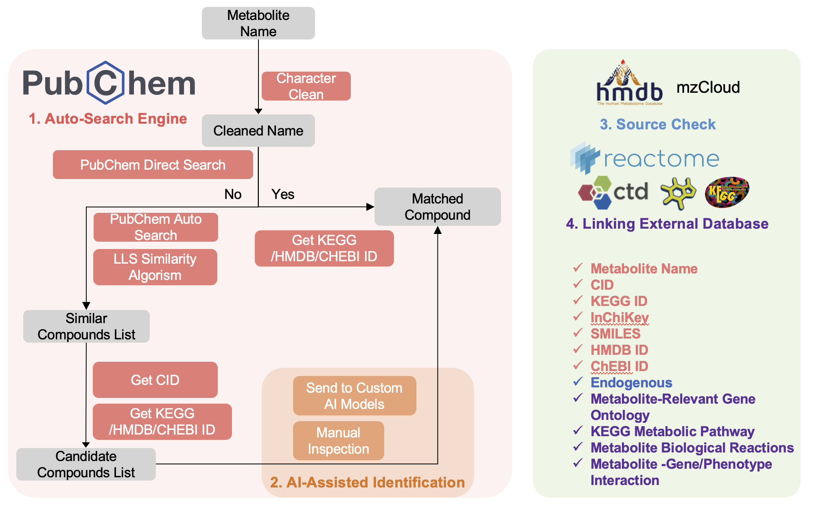

# MetaboAnnotator User Manual

<div align="center">
  
  <br>
  <em>Comprehensive Metabolomics Data Analysis and Annotation Tool</em>
</div>

## Table of Contents

- [1. Introduction](#1-introduction)
- [2. System Requirements](#2-system-requirements)
- [3. Installation](#3-installation)
- [4. Getting Started](#4-getting-started)
- [5. Main Features](#5-main-features)
- [6. Step-by-Step Usage Guide](#6-step-by-step-usage-guide)
- [7. Troubleshooting](#7-troubleshooting)
- [8. Data Export and Results](#8-data-export-and-results)
- [9. Best Practices](#9-best-practices)
- [10. Technical Support](#10-technical-support)

---

## 1. Introduction

**MetaboAnnotator** is a powerful R-based application designed for metabolomics data analysis and annotation. It provides an integrated solution for compound identification, AI-assisted annotation, and pathway analysis by leveraging multiple databases and AI technologies.

<div align="center">
  
  <br>
  <em>Figure 1: MetaboAnnotator Workflow</em>
</div>

### Key Features

- ✅ **Real-time database querying** (PubChem, HMDB, mzCloud, KEGG)
- 🤖 **AI-assisted compound identification**
- 🧪 **Endogenous metabolite identification**
- 🔄 **Pathway enrichment analysis**
- 🧬 **Chemical-gene/phenotype interaction analysis**

---

## 2. System Requirements

### Hardware Requirements
- **Processor**: Multi-core processor (Intel i5/AMD Ryzen 5 or better recommended)
- **Memory**: Minimum 8GB RAM (16GB or more recommended)
- **Storage**: At least 10GB free disk space
- **Internet**: Stable broadband connection

### Software Requirements
- **Operating System**: Windows 10/11, macOS 10.15+, or Linux (Ubuntu 20.04+)
- **R environment**: R 4.0.0 or higher (preferably RStudio)
- **Required R packages**:
  
  | Package | Purpose |
  |---------|---------|
  | `shiny` | Web application framework |
  | `shinyjs` | JavaScript operations in Shiny |
  | `shinycssloaders` | Loading animations |
  | `ellmer` | Data processing |
  | `DT` | Interactive data tables |
  | `dplyr` | Data manipulation |
  | `KEGGREST` | KEGG database access |
  | `ggplot2` | Data visualization |
  | `rmarkdown` | Report generation |

---

## 3. Installation

### Step 1: Install R and RStudio
1. Download and install R from [CRAN](https://cran.r-project.org/)
2. Download and install RStudio from [RStudio Downloads](https://www.rstudio.com/products/rstudio/download/)

### Step 2: Install MetaboAnnotator
```R
# Initialize the application in your desired working directory
MetaboAnnotator::init_app('your_work_path')
```

> **Note**: This function will create a new directory in your working path and automatically detect and update necessary files including PubChem CID-Parent file, ChEBI file, CTD database file, etc.

### Step 3: Launch the Application
```R
# Start the MetaboAnnotator user interface
MetaboAnnotator::run_ui()
```

---

## 4. Getting Started

### Initial Setup

<div align="center">
  
  <br>
  <em>Figure 2: MetaboAnnotator Data Sources</em>
</div>

1. **Launch RStudio**
   - Open RStudio from your applications menu
   
2. **Set your working directory**
   - Use `setwd()` or the RStudio interface to set your working directory
   
3. **Run the initialization command**
   - Execute `MetaboAnnotator::init_app('your_work_path')`
   - Wait for all necessary files to download and install
   
4. **Launch the application**
   - Execute `MetaboAnnotator::run_ui()`
   
5. **Access the interface**
   - The application will automatically open in your default web browser
   - The interface consists of multiple tabs for different analysis steps

---

## 5. Main Features

### 5.1 Compound Auto-search (Tab 1)

<div align="center">
  <em>Figure 3: Compound Auto-search Interface</em>
</div>

- **Input compound names** (one per line)
- **Real-time search** across multiple databases
- **Cache management options**
- **Progress monitoring** through console output

### 5.2 AI-assisted Identification (Tab 2)

<div align="center">
  <em>Figure 4: AI-assisted Identification Interface</em>
</div>

- **Supported AI models**:
  - `deepseek`
  - `gpt-4o-mini`
  - Custom models (configurable)
  
- **Features**:
  - Custom API configuration
  - Customizable identification prompts
  - Result review and confirmation
  - Real-time processing logs

### 5.3 KEGG Analysis

<div align="center">
  <em>Figure 5: KEGG Analysis Interface</em>
</div>

- **Pathway mapping**
- **Metabolic pathway analysis** (81 pathways)
- **Reaction pathway analysis** (13 pathways)
- **Interactive visualization**

### 5.4 Endogenous Metabolite Identification

<div align="center">
  <em>Figure 6: Endogenous Metabolite Identification Interface</em>
</div>

- **HMDB database integration**
- **mzCloud database integration**
- **Automated annotation**

---

## 6. Step-by-Step Usage Guide

### 6.1 Compound Search

1. **Navigate to "1. Compound Auto-search"**
   - Click on the "1. Compound Auto-search" tab in the navigation bar

2. **Enter compound names**
   - Type or paste compound names in the text area
   - Enter one compound per line
   - Example:
     ```
     Prostaglandin E2
     Prostaglandin D2
     Arachidonic acid
     ```

3. **Configure search options**
   - Check "Clear cache before running" if you want to start fresh
   - Uncheck to continue from previous unfinished processing

4. **Start the search**
   - Click the "Start Search" button
   - The search process will begin immediately

5. **Monitor progress**
   - Watch the console on the right side for real-time updates
   - The console will display each step of the search process

### 6.2 AI-assisted Identification

1. **Navigate to "2. AI-assisted Identification"**
   - Click on the "2. AI-assisted Identification" tab

2. **Load previous results**
   - Click "Load Local Results" to import data from Step 1

3. **Select AI model**
   - Choose between "deepseek" or "gpt-4o-mini"
   - Note: Reasoner models are not recommended

4. **Configure API settings**
   - Enter API URL (if using a custom endpoint)
   - Provide your personal API key
   - Set custom model name (if applicable)

5. **Customize identification prompt (optional)**
   - Modify the default prompt or use as provided
   - The prompt helps guide the AI in identifying compounds

6. **Start identification**
   - Click "Start AI Identification"
   - The process will begin and show progress in the console

7. **Review results**
   - Examine the identification results in the table
   - Adjust selections as needed

8. **Confirm and continue**
   - Click "Confirm Selection and Continue" to proceed

### 6.3 External Dataset Annotation

- **KEGG pathway analysis**
  - 81 metabolic pathways
  - 13 reaction pathways
  - Interactive pathway maps

- **Reactome pathway analysis**
  - 10,000+ reactions
  - Hierarchical pathway organization

- **CTD compound annotation**
  - Chemical-Gene interactions
  - Chemical-Phenotype interactions
  - GO enrichment analysis

---

## 7. Troubleshooting

### Common Issues and Solutions

#### Connection Issues

| Problem | Solution |
|---------|----------|
| Database connection fails | Check internet connectivity |
| API calls time out | Verify API key validity |
| Slow database response | Ensure database endpoints are accessible |

#### Performance Issues

| Problem | Solution |
|---------|----------|
| Slow processing | Clear cache if processing is slow |
| Application freezes | Check system resources (CPU/RAM usage) |
| Large dataset handling | Reduce batch size for large datasets |

#### Result Accuracy

| Problem | Solution |
|---------|----------|
| Incorrect identifications | Verify input format and spelling |
| Missing annotations | Check compound naming conventions |
| AI inconsistencies | Review and adjust AI identification settings |

---

## 8. Data Export and Results

### 8.1 Results Location

- **Process report file** available in Step 6 ("6. Report Download")
- **Detailed analysis records** including:
  - Compound identification results
  - Database matches
  - Pathway analysis
  - AI reasoning
- **Export options** for different formats (CSV, Excel, PDF)

### 8.2 Data Interpretation

- **Understanding pathway analysis results**
  - Significance scores
  - Pathway coverage
  - Visualization interpretation

- **Interpreting AI-assisted identifications**
  - Confidence scores
  - Alternative matches
  - Structural similarities

- **Reviewing compound annotations**
  - Database cross-references
  - Chemical properties
  - Biological relevance

---

## 9. Best Practices

### 9.1 Input Data

- **Use standardized compound names**
  - Follow IUPAC nomenclature when possible
  - Include common synonyms for better matching

- **Verify spelling and formatting**
  - Double-check compound names before submission
  - Avoid special characters unless part of the name

- **Keep batch sizes manageable**
  - Process 50-100 compounds at a time for optimal performance
  - Split larger datasets into multiple runs

### 9.2 AI Model Selection

- **Choose appropriate models for your use case**
  - `deepseek` for general compound identification
  - `gpt-4o-mini` for more complex structural analysis

- **Configure custom prompts for specific needs**
  - Add domain-specific rules
  - Include special cases for your compound classes

- **Review and validate AI suggestions**
  - Always verify AI results against database matches
  - Use AI as an assistant, not the final authority

### 9.3 Database Updates

- **Regular cache clearing for fresh results**
  - Clear cache weekly for frequent users
  - Always clear before critical analyses

- **Verify database version compatibility**
  - Check for database updates in the console logs
  - Update application if database formats change

- **Monitor update notifications**
  - Watch for messages about database changes
  - Update reference files when prompted

---

## 10. Technical Support

### Getting Help

- **Report issues** on the project's [issue page](https://github.com/yourusername/MetaboAnnotator/issues)
- **Check documentation** for updates and FAQs
- **Contact support team** for advanced issues at support@example.com

### Citation

When using MetaboAnnotator in your research, please cite:

```bibtex
test_bibtex
```

### Data Sources

The application integrates with multiple databases:

| Database | Purpose | Reference |
|----------|---------|-----------|
| PubChem | Chemical information | Kim S, et al. (2018) |
| HMDB | Human metabolome | Wishart DS, et al. (2022) |
| mzCloud | Mass spectra | - |
| KEGG | Pathway data | Kanehisa M, et al. (2025) |
| CTD | Toxicogenomics | Davis AP, et al. (2024) |
| Reactome | Pathway knowledge | Milacic M, et al. (2024) |
| ChEBI | Chemical entities | Hastings J, et al. (2016) |

Each database is regularly updated to ensure accurate and current information for your analyses.

---

<div align="center">
  <p>This manual provides a comprehensive guide to using MetaboAnnotator. For specific questions or issues not covered here, please refer to the project's issue page or contact technical support.</p>
  <p>© 2024 MetaboAnnotator Team. All rights reserved.</p>
</div>